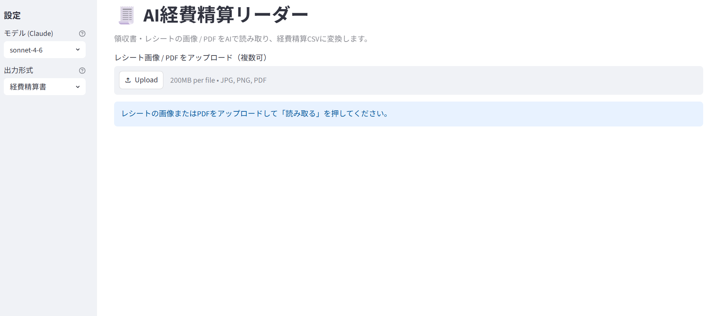
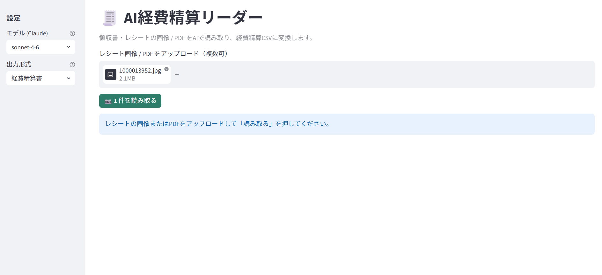
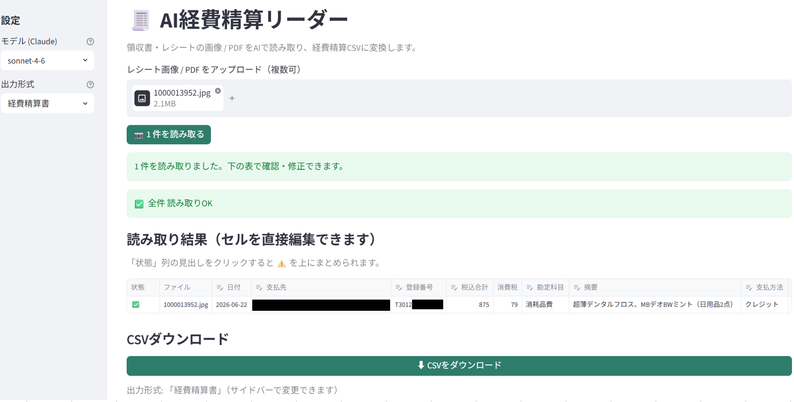

# 🧾 AI経費精算リーダー（画像 / PDF）

領収書・レシートの画像 / PDF を **AI（Claude）** で読み取り、日付・支払先・金額・税率・**登録番号(T番号)** を自動で構造化。さらに **勘定科目を推定**して、経費精算CSVを出力する Streamlit Webアプリです。経理の「1枚ずつ手入力」をなくします。

> 📌 このツールはポートフォリオ作品です。類似ツールのご依頼は[ランサーズのプロフィール](https://www.lancers.jp/profile/hongu_works?ref=header_menu)からお願いします。

## デモ

1. レシートの画像 / PDF をアップロード（複数可・スマホ写真OK）
2. 「読み取る」を押すと、AIが項目を抽出して表に表示
3. 表で確認・修正（勘定科目はドロップダウン、要確認は ⚠️ 表示）
4. 「経費精算書CSV」をダウンロード

<!-- スクリーンショット / デモGIF は docs/ に追加予定 -->

## 対象クライアント

- 個人事業主・フリーランス（自分の経費をまとめてデータ化）
- 中小企業で立替精算する従業員・経理担当
- 税理士事務所のスタッフ

## 主な機能

| 機能 | 内容 |
|------|------|
| 画像 / PDF をAIで読み取り | 日付・支払先・金額・**税率別内訳(10%/8%)**・**登録番号(T番号)** を自動抽出。複数枚・スマホ写真もOK |
| 勘定科目の自動推定 | 店名・品目から「消耗品費」「会議費」等を提案（最終確認は人が修正） |
| CSV出力 | 確認・修正して経費精算書CSVをダウンロード（Excelでそのまま開ける） |

**インボイス制度・軽減税率に対応**：適格請求書発行事業者の登録番号(T番号)を抽出し、10%/8%が混在するレシートは税率別に内訳を取ります。

> 出力形式は「経費精算書」が動作します。freee・マネーフォワード クラウド・弥生 などの会計ソフト専用フォーマットは、各社の取込仕様に合わせて拡張できる設計です（本デモでは未実装）。

## 使い方

Windows（PowerShell）での手順です。

**1. 仮想環境を作成して依存をインストール**

```powershell
python -m venv .venv
.\.venv\Scripts\python.exe -m pip install -r requirements.txt
```

**2. APIキーを設定**

1. `.env.example` をコピーする
2. コピーしたファイルの名前を `.env` に変更する
3. `.env` を開き、`ANTHROPIC_API_KEY=` の右に自分のキーを記入する

```
ANTHROPIC_API_KEY=sk-ant-xxxxxxxxxxxxxxxx
```

（PowerShellで一気にやる場合：`Copy-Item .env.example .env` でコピー＆改名 → その後 `.env` を開いてキーを記入）

**3. アプリを起動**

```powershell
.\.venv\Scripts\streamlit run streamlit_app.py
```

→ ブラウザで `http://localhost:8501` が開きます。停止は `Ctrl + C`。

- Claude APIキーは [Anthropic Console](https://console.anthropic.com/) で取得します。
- `.env` は `.gitignore` 済みのため、キーがリポジトリに含まれることはありません。

**4. レシートを読み取って CSV を出力**

**① レシート画像 / PDF をアップロードする**（複数可・スマホ写真OK）

「Upload」ボタンから選んでも、ファイルを枠内にドラッグ&ドロップしてもアップロードできます。




**② 〇件を読み取るボタンを押す**




**③ AIが項目を抽出 → 表で確認・修正**

**④「⬇ CSVをダウンロード」で経費精算書CSVを保存**



## 注意

- **APIコスト**：レシート1枚を読むたびに少額のAPI料金がかかります（Claude Sonnet でおよそ 1〜2円/枚）。
- **データの扱い**：読み取りのため、画像/PDFは Claude API に送信されます（Anthropic は API データを学習に使用しません）。
- このツールは**ローカルで `streamlit run` して使う**前提で、一般公開はしていません。

---

## 開発者向け情報

<details>
<summary>技術スタック / ディレクトリ構成 / 設計</summary>

### 技術スタック

- **Python 3.12**
- **Streamlit** — Webアプリ（アップロード・編集できる表・CSVダウンロード）
- **Anthropic Claude API**（`anthropic`）— 画像/PDFを直接読み取り（既定 `claude-sonnet-4-6`）。**Structured Outputs** で出力をスキーマに固定
- **pandas** — CSV生成（UTF-8 BOM）
- **PyMuPDF / python-dotenv / Pydantic**

OCRエンジンを別に持たず、Claude のビジョンで「項目抽出 + 勘定科目の推定」を1回の呼び出しで行うのが特徴です。

### ディレクトリ構成

```
04_ai_invoice_reader/
├── README.md
├── requirements.txt          # 依存ライブラリ
├── .env.example              # APIキー設定テンプレート
├── streamlit_app.py          # アプリ本体（ルート配置）
├── .streamlit/
│   └── config.toml           # テーマ
├── src/
│   ├── extractor.py          # Claude呼び出し・抽出スキーマ・金額の検算
│   ├── loader.py             # 画像/PDF → Claudeへ渡す形式(base64)に変換
│   ├── accounts.py           # 勘定科目の候補リスト
│   └── csv_writer.py         # 経費精算書 / 会計仕訳 のCSV生成
└── docs/                     # 設計ドキュメント
```

### 抽出スキーマ（Structured Outputs / Pydantic）

`src/extractor.py` の `Receipt` で出力形式を固定し、読み取り結果が常に同じ構造で返るようにしています。

| 項目 | 内容 |
|------|------|
| `used_date` | 利用日 (YYYY-MM-DD) |
| `vendor_name` | 支払先 |
| `registration_number` | 登録番号 T+13桁（なければ null） |
| `total_amount` | 税込合計 |
| `tax_lines` | 税率別の内訳（rate / taxable_amount / tax_amount） |
| `payment_method` | 支払方法 |
| `description` | 摘要 |
| `suggested_account` | 推定勘定科目 |
| `account_reason` | 推定の根拠 |
| `confidence_notes` | 読み取りで不確かだった点 |

読み取り後、`verify_totals()` で「税率別内訳の合計 ＝ 税込合計」を検算し、合わない行・`confidence_notes` のある行を画面で ⚠️ 表示します。

</details>
